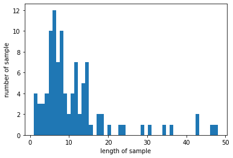

# 자연어 전처리 이해하기
---

## 1. 토큰화(Tokenization)

주어진 텍스트를 단어 또는 문자 단위로 자르는 것을 토큰화라고 함.
영어의 경우 토큰화를 사용하는 도구로서대표적으로 spaCy와 NLTK가 있고 파이썬 기본 함수인 split로도 토큰화를 할 수 있다.


```python
# 영어 토큰화 실습

en_text=  "I do the same thing I told you that I never would"
```

### spaCy 사용하기


```python
import spacy
spacy_en = spacy.blank("en")
```


```python
def tokenize(en_text):
    return [tok.text for tok in spacy_en.tokenizer(en_text)]
```


```python
print(tokenize(en_text))
```

    ['I', 'do', 'the', 'same', 'thing', 'I', 'told', 'you', 'that', 'I', 'never', 'would']


## NLTK 사용하기


```python
import nltk
nltk.download('punkt')
```

    [nltk_data] Downloading package punkt to /home/ubuntu/nltk_data...
    [nltk_data]   Package punkt is already up-to-date!


    True


```python
from nltk.tokenize import word_tokenize
print(word_tokenize(en_text))
```

    ['I', 'do', 'the', 'same', 'thing', 'I', 'told', 'you', 'that', 'I', 'never', 'would']


## 형태소 토큰화 - 한글 실습


```python
!git clone https://github.com/SOMJANG/Mecab-ko-for-Google-Colab.git
%cd Mecab-ko-for-Google-Colab
!bash install_mecab-ko_on_colab190912.s
```

    fatal: destination path 'Mecab-ko-for-Google-Colab' already exists and is not an empty directory.
    /home/ubuntu/Dacon/hyup/Mecab-ko-for-Google-Colab
    bash: install_mecab-ko_on_colab190912.s: No such file or directory


```python
from konlpy.tag import Okt
kor_text = "사과의 놀라운 효능이라는 글을 봤어. 그래서 오늘 사과를 먹으려고 했는데 사과가 썩어서 슈퍼에 가서 사과랑 오렌지 사왔어"
tokenizer = Okt()
print(tokenizer.morphs(kor_text))
```

    ['사과', '의', '놀라운', '효능', '이라는', '글', '을', '봤어', '.', '그래서', '오늘', '사과', '를', '먹으려고', '했는데', '사과', '가', '썩어서', '슈퍼', '에', '가서', '사과', '랑', '오렌지', '사왔어']


## 2.단어 집합(Vocabulary) 생성
단어 집합 이란 중복을 제거한 텍스트의 총 단어의 집합(set)을 의미  
네이버 영화 리뷰 데이터를 이용해 실습 진행.


```python
import urllib.request
import pandas as pd
from konlpy.tag import Mecab
from nltk import FreqDist
import numpy as np
import matplotlib.pyplot as plt
```


```python
urllib.request.urlretrieve("https://raw.githubusercontent.com/e9t/nsmc/master/ratings.txt", filename="ratings.txt")
data = pd.read_table('ratings.txt') # 데이터프레임에 저장
data[:10]
```


<div>
<style scoped>
    .dataframe tbody tr th:only-of-type {
        vertical-align: middle;
    }

    .dataframe tbody tr th {
        vertical-align: top;
    }

    .dataframe thead th {
        text-align: right;
    }
</style>
<table border="1" class="dataframe">
  <thead>
    <tr style="text-align: right;">
      <th></th>
      <th>id</th>
      <th>document</th>
      <th>label</th>
    </tr>
  </thead>
  <tbody>
    <tr>
      <th>0</th>
      <td>8112052</td>
      <td>어릴때보고 지금다시봐도 재밌어요ㅋㅋ</td>
      <td>1</td>
    </tr>
    <tr>
      <th>1</th>
      <td>8132799</td>
      <td>디자인을 배우는 학생으로, 외국디자이너와 그들이 일군 전통을 통해 발전해가는 문화산...</td>
      <td>1</td>
    </tr>
    <tr>
      <th>2</th>
      <td>4655635</td>
      <td>폴리스스토리 시리즈는 1부터 뉴까지 버릴께 하나도 없음.. 최고.</td>
      <td>1</td>
    </tr>
    <tr>
      <th>3</th>
      <td>9251303</td>
      <td>와.. 연기가 진짜 개쩔구나.. 지루할거라고 생각했는데 몰입해서 봤다.. 그래 이런...</td>
      <td>1</td>
    </tr>
    <tr>
      <th>4</th>
      <td>10067386</td>
      <td>안개 자욱한 밤하늘에 떠 있는 초승달 같은 영화.</td>
      <td>1</td>
    </tr>
    <tr>
      <th>5</th>
      <td>2190435</td>
      <td>사랑을 해본사람이라면 처음부터 끝까지 웃을수 있는영화</td>
      <td>1</td>
    </tr>
    <tr>
      <th>6</th>
      <td>9279041</td>
      <td>완전 감동입니다 다시봐도 감동</td>
      <td>1</td>
    </tr>
    <tr>
      <th>7</th>
      <td>7865729</td>
      <td>개들의 전쟁2 나오나요? 나오면 1빠로 보고 싶음</td>
      <td>1</td>
    </tr>
    <tr>
      <th>8</th>
      <td>7477618</td>
      <td>굿</td>
      <td>1</td>
    </tr>
    <tr>
      <th>9</th>
      <td>9250537</td>
      <td>바보가 아니라 병 쉰 인듯</td>
      <td>1</td>
    </tr>
  </tbody>
</table>
</div>


```python
# 데이터의 갯수 확인
len(data)
```


    200000


```python
# 임의로 100개만 사용
sample_data = data[:100]
sample_data
```


<div>
<style scoped>
    .dataframe tbody tr th:only-of-type {
        vertical-align: middle;
    }

    .dataframe tbody tr th {
        vertical-align: top;
    }

    .dataframe thead th {
        text-align: right;
    }
</style>
<table border="1" class="dataframe">
  <thead>
    <tr style="text-align: right;">
      <th></th>
      <th>id</th>
      <th>document</th>
      <th>label</th>
    </tr>
  </thead>
  <tbody>
    <tr>
      <th>0</th>
      <td>8112052</td>
      <td>어릴때보고 지금다시봐도 재밌어요ㅋㅋ</td>
      <td>1</td>
    </tr>
    <tr>
      <th>1</th>
      <td>8132799</td>
      <td>디자인을 배우는 학생으로, 외국디자이너와 그들이 일군 전통을 통해 발전해가는 문화산...</td>
      <td>1</td>
    </tr>
    <tr>
      <th>2</th>
      <td>4655635</td>
      <td>폴리스스토리 시리즈는 1부터 뉴까지 버릴께 하나도 없음.. 최고.</td>
      <td>1</td>
    </tr>
    <tr>
      <th>3</th>
      <td>9251303</td>
      <td>와.. 연기가 진짜 개쩔구나.. 지루할거라고 생각했는데 몰입해서 봤다.. 그래 이런...</td>
      <td>1</td>
    </tr>
    <tr>
      <th>4</th>
      <td>10067386</td>
      <td>안개 자욱한 밤하늘에 떠 있는 초승달 같은 영화.</td>
      <td>1</td>
    </tr>
    <tr>
      <th>...</th>
      <td>...</td>
      <td>...</td>
      <td>...</td>
    </tr>
    <tr>
      <th>95</th>
      <td>3908729</td>
      <td>진짜 최고다 최고 성룡형님 마이 우상</td>
      <td>1</td>
    </tr>
    <tr>
      <th>96</th>
      <td>6318878</td>
      <td>amy6250 당신이 좋아하는 장르는 뭐요? 이영화에도 저영화에도 이런장르는 싫다니원</td>
      <td>1</td>
    </tr>
    <tr>
      <th>97</th>
      <td>2620222</td>
      <td>지금까지 본영화중에 최고다</td>
      <td>1</td>
    </tr>
    <tr>
      <th>98</th>
      <td>5954450</td>
      <td>매회리타가자꾸거슬려서죽었으면좋겠다고생각했는데ㅠㅠ죄책감에나도잠못이룬다.</td>
      <td>1</td>
    </tr>
    <tr>
      <th>99</th>
      <td>9754970</td>
      <td>어릴 때보고 커서 다시 봤는데. 진짜 잘 만든 영화였네. 웃음과 감동을 잘 이어 붙...</td>
      <td>1</td>
    </tr>
  </tbody>
</table>
<p>100 rows × 3 columns</p>
</div>


```python
# 정규 표현식을 활용하여 데이터 정제
sample_data['document'] = sample_data['document'].str.replace('[^ㄱ-ㅎㅏ-ㅣ가-힣 ]',"")
sample_data[:10]
```

    /home/ubuntu/.local/lib/python3.6/site-packages/ipykernel_launcher.py:2: SettingWithCopyWarning: 
    A value is trying to be set on a copy of a slice from a DataFrame.
    Try using .loc[row_indexer,col_indexer] = value instead
    
    See the caveats in the documentation: https://pandas.pydata.org/pandas-docs/stable/user_guide/indexing.html#returning-a-view-versus-a-copy
      


<div>
<style scoped>
    .dataframe tbody tr th:only-of-type {
        vertical-align: middle;
    }

    .dataframe tbody tr th {
        vertical-align: top;
    }

    .dataframe thead th {
        text-align: right;
    }
</style>
<table border="1" class="dataframe">
  <thead>
    <tr style="text-align: right;">
      <th></th>
      <th>id</th>
      <th>document</th>
      <th>label</th>
    </tr>
  </thead>
  <tbody>
    <tr>
      <th>0</th>
      <td>8112052</td>
      <td>어릴때보고 지금다시봐도 재밌어요ㅋㅋ</td>
      <td>1</td>
    </tr>
    <tr>
      <th>1</th>
      <td>8132799</td>
      <td>디자인을 배우는 학생으로 외국디자이너와 그들이 일군 전통을 통해 발전해가는 문화산업...</td>
      <td>1</td>
    </tr>
    <tr>
      <th>2</th>
      <td>4655635</td>
      <td>폴리스스토리 시리즈는 부터 뉴까지 버릴께 하나도 없음 최고</td>
      <td>1</td>
    </tr>
    <tr>
      <th>3</th>
      <td>9251303</td>
      <td>와 연기가 진짜 개쩔구나 지루할거라고 생각했는데 몰입해서 봤다 그래 이런게 진짜 영화지</td>
      <td>1</td>
    </tr>
    <tr>
      <th>4</th>
      <td>10067386</td>
      <td>안개 자욱한 밤하늘에 떠 있는 초승달 같은 영화</td>
      <td>1</td>
    </tr>
    <tr>
      <th>5</th>
      <td>2190435</td>
      <td>사랑을 해본사람이라면 처음부터 끝까지 웃을수 있는영화</td>
      <td>1</td>
    </tr>
    <tr>
      <th>6</th>
      <td>9279041</td>
      <td>완전 감동입니다 다시봐도 감동</td>
      <td>1</td>
    </tr>
    <tr>
      <th>7</th>
      <td>7865729</td>
      <td>개들의 전쟁 나오나요 나오면 빠로 보고 싶음</td>
      <td>1</td>
    </tr>
    <tr>
      <th>8</th>
      <td>7477618</td>
      <td>굿</td>
      <td>1</td>
    </tr>
    <tr>
      <th>9</th>
      <td>9250537</td>
      <td>바보가 아니라 병 쉰 인듯</td>
      <td>1</td>
    </tr>
  </tbody>
</table>
</div>


```python
# 토큰화 과정에서 불용어 제거를 위해 불용어 정의
stopwords = ['의','가','이','은','들','는','좀','잘','걍','과','도','를','으로','자','에','와','한','하다']
```


```python
# 형태소 분석기는 Okt 사용
tokenizer = Okt()
```


```python
tokenized = []

for sentence in sample_data['document']:
    temp = tokenizer.morphs(sentence) # 토큰화
    temp = [word for word in temp if not word in stopwords] #불용어 제거
    tokenized.append(temp)
```


```python
# 단어 집합 생성
# nltk에서 빈도수 계산 도구인 FreqDist() 활용
vocab = FreqDist(np.hstack(tokenized))
print('단어 집합의 크기 : {}'.format(len(vocab)))
```

    단어 집합의 크기 : 761


```python
# most_common()을 이용해 상위 빈도수 500개의 단어만 단어 집합으로 생성
vocab_size = 500

vocab = vocab.most_common(vocab_size)
print('단어 집합의 크기 : {}'.format(len(vocab)))
```

    단어 집합의 크기 : 500


## 3. 각 단어에 고유한 정수 부여 
인덱스 0과 1은 다른 용도로 남겨 두고 나머지 단어들은 2부터 501까지 순차적으로 인덱스를 부여


```python
word_to_index = {word[0] : index + 2 for index, word in enumerate(vocab)}
word_to_index['pad'] = 1
word_to_index['unk'] = 0
```


```python
# 기존 훈련 데이터에서 각 단어를 고유한 정수로 변환

encoded = []

for line in tokenized :
    temp = []
    for w in line: 
        try:
            temp.append(word_to_index[w])# 글자를 해당되는 정수로 변환
        except KeyError : # 단어 집합에 없는 단어일 경우 unk로 대체
            temp.append(word_to_index['unk']) # unk의 인덱스로 변환
    encoded.append(temp)
```


```python
print(encoded[:10])
```

    [[44, 9, 36, 24, 25, 45, 149, 26], [150, 3, 151, 152, 153, 154, 10, 155, 75, 3, 156, 157, 158, 76, 159, 160, 37, 77, 78, 10, 161, 162, 79, 16, 163, 3, 164, 165, 27, 75, 166, 28, 27, 17, 167, 3, 168, 169, 170, 18, 171, 46, 172], [173, 174, 29, 175, 16, 176, 80, 81, 4], [19, 11, 82, 177, 178, 12, 47, 179, 83, 84, 180, 181, 11, 2, 85], [182, 183, 184, 185, 86, 186, 27, 2], [87, 3, 187, 17, 88, 89, 29, 79, 16, 188, 86, 2], [90, 13, 189, 25, 45, 13], [82, 190, 191, 192, 193, 20, 36, 194], [91], [195, 196, 197, 198, 199]]


## 4. 길이가 다른 문장들을 모두 동일한 길이로 바꿔주는 패딩(padding)
패딩 작업은 정해준 길이로 모든 샘플들의 길이를 맞춰주되, 길이가 정해준 길이보다 짧은 샘플들에게는 'pad' 토큰을 추가하여 길이를 맞춰주는 작업.


```python
max_len = max(len(l) for l in encoded)
print('리뷰의 최대 길이 : %d' % max_len)
print('리뷰의 최소 길이 : %d' % min(len(l) for l in encoded))
print('리뷰의 평균 길이 : %f' % (sum(map(len, encoded))/len(encoded)))
plt.hist([len(s) for s in encoded], bins=50)
plt.xlabel('length of sample')
plt.ylabel('number of sample')
plt.show()
```

    리뷰의 최대 길이 : 48
    리뷰의 최소 길이 : 1
    리뷰의 평균 길이 : 11.350000


    

    

